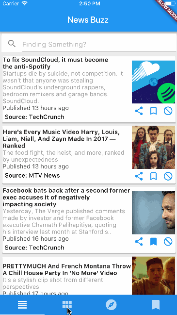

# News Buzz

News App created in `Flutter` using `News API` and uses `Firebase` as the backend and authentication.


## Features

* Custom news feed based on selected sources
* Saving articles
* Explore news based on categories
* Search for topics
* Sharing articles


## Preview




## Dependencies

* [Flutter](https://flutter.io/)
* [Firebase](https://github.com/flutter/plugins/blob/master/FlutterFire.md)
* [Google Sign In](https://github.com/flutter/plugins/tree/master/packages/google_sign_in)
* [Flutter Webview Plugin](https://github.com/dart-flitter/flutter_webview_plugin)
* [News API](https://newsapi.org/)


## Getting Started

#### 1. [Setup Flutter](https://flutter.io/setup/)
#### 2. Clone the repo
```sh
$ git clone https://github.com/theankurkedia/newsbuzz.git
$ cd newsbuzz/
```

#### 3. Setup firebase app
1. You'll need to create a Firebase instance. Follow the instructions at https://console.firebase.google.com.
2. Once your Firebase instance is created, you'll need to enable anonymous authentication.
  - Go to the Firebase Console for your new instance.
  - Click "Authentication" in the left-hand menu
  - Click the "sign-in method" tab
  - Click "anonymous" and enable it
3. (skip if not running on Android) 
- Create an app within your Firebase instance for Android, with package name com.yourcompany.news 
- Follow instructions to download google-services.json, and place it into newsbuzz/android/app/
- Run the following command to get your SHA-1 key:
```
keytool -exportcert -list -v \
-alias androiddebugkey -keystore ~/.android/debug.keystore
```
- In the Firebase console, in the settings of your Android app, add your SHA-1 key by clicking "Add Fingerprint".
4. (skip if not running on iOS) 
- Create an app within your Firebase instance for iOS, with package name com.yourcompany.news
- Follow instructions to download GoogleService-Info.plist, and place it into newsbuzz/ios/Runner in XCode
- Open newsbuzz/ios/Runner/Info.plist. Locate the CFBun
dleURLSchemes key. The second item in the array value of this key is specific to the Firebase instance. Replace it with the value for REVERSED_CLIENT_ID from GoogleService-Info.plist

#### 4. Run the app
```sh
$ flutter run
```
